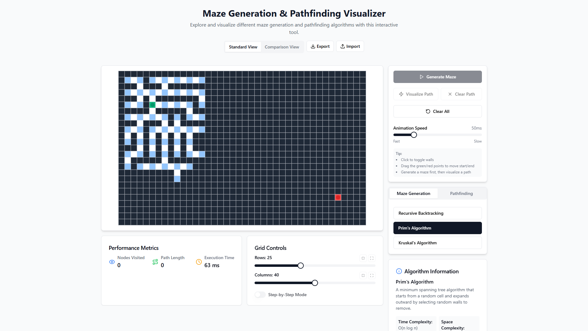
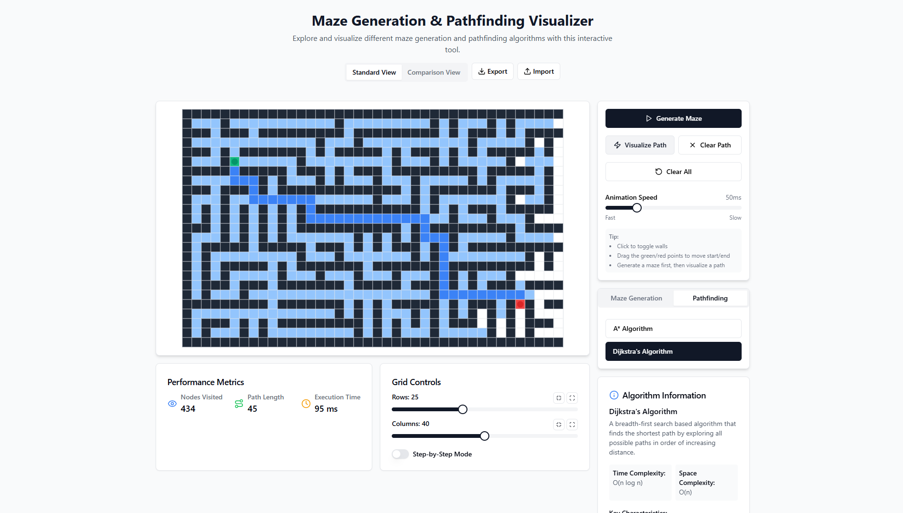

# 🧩 Maze Generation & Pathfinding Visualizer

An interactive web app to visualize maze generation and pathfinding algorithms in action 🚀. Built using **React**, styled with **Tailwind CSS**, and powered by **Vite** for ultra-fast performance. Ideal for students, developers, and visual learners!

## 📸 Screenshots

### 🔧 Maze Generation

---

### 🔍 Pathfinding Algorithm

---

## 🔗 Live Demo

Check it out here 👇  
👉 [Maze Generation & Pathfinding Visualizer](https://maze-generation-pathfinding-visualizer.vercel.app)

---

## ✨ Features

- 🎯 Visualize classic **maze generation** algorithms:
  - Recursive Backtracking
  - Prim’s Algorithm
  - Kruskal’s Algorithm
- 🧠 Understand **pathfinding** algorithms:
  - A* (A-Star)
  - Dijkstra’s Algorithm
- 🖱️ Interact with the grid: place walls, drag start/end nodes
- ♻️ Reset the grid and try different combinations
- 🧼 Clean and responsive design

---

## ⚙️ Tech Stack

- **Frontend**: React (Vite), Tailwind CSS
- **Languages**: JavaScript (ES6+), HTML5, CSS3

---

## 📁 Folder Structure

📦 Maze-Generation-Pathfinding-Visualizer 
├── 📂 public/ ├── 📂 src/ │ 
├── 📂 components/ # All UI and grid logic │ 
├── 📂 algorithms/ # Maze & pathfinding logic │ 
├── App.jsx # Root component 
│ └── main.jsx # Entry point 
├── 📂 styles/ │ └── tailwind.css 
├── package.json 
├── vite.config.js 
└── README.md

🧑‍💻 Author
Made with ❤️ by Sarthak
📬 Drop a ⭐ if you like the project!
